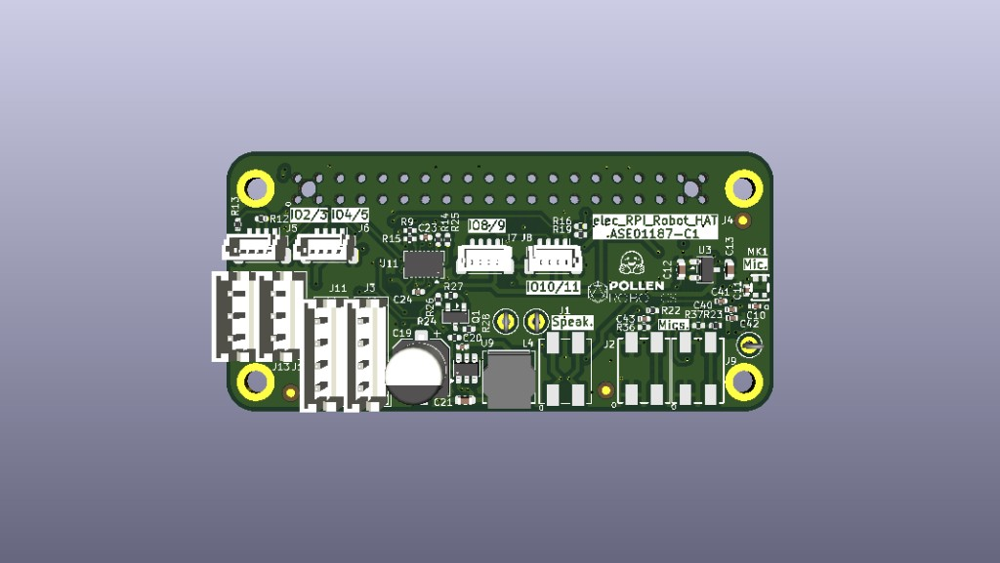
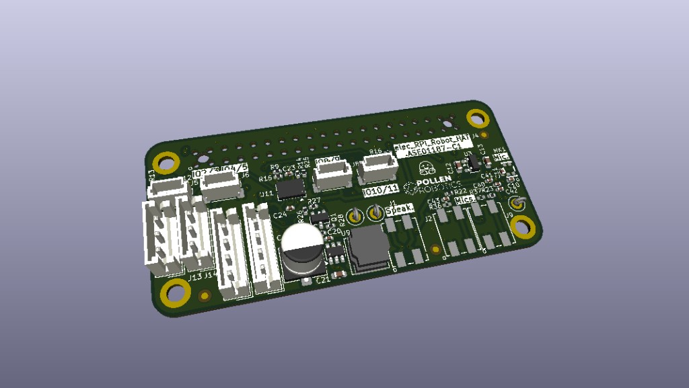
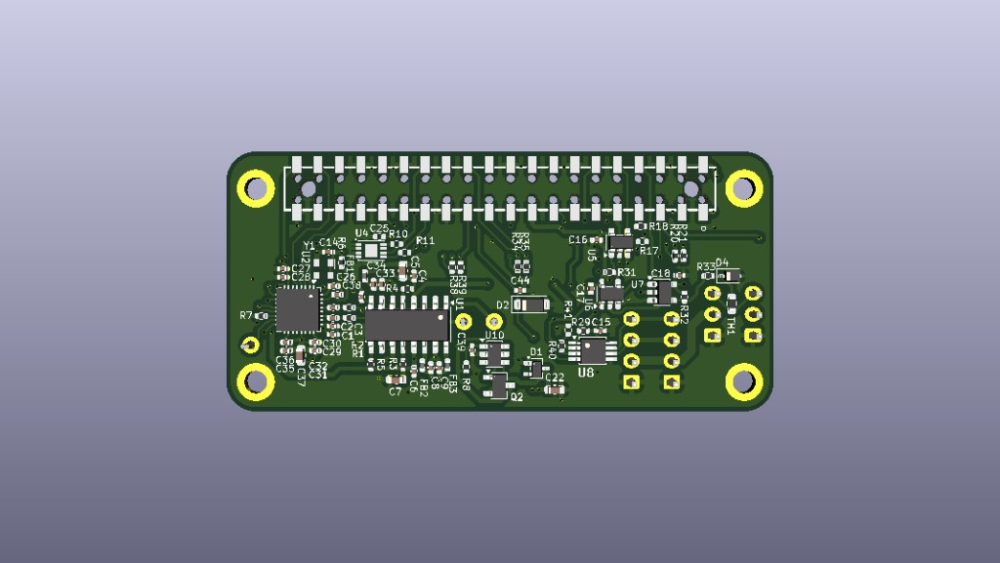
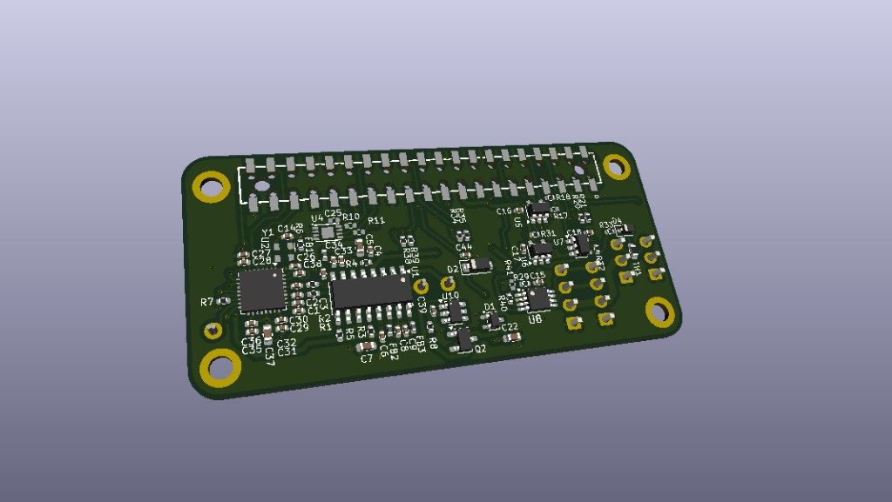

# HAT 板信息卡

> **官方开源** · 工程 `ASE01187-C1` / PCB `PCB01186-C1`。实体总页：[[elec-rpi-robot-hat]]。  
> 电控总入口：[[elec-three-boards]] · 接线：[[board-interconnect]]。

## 1. 身份与角色

| 项 | 内容 |
|----|------|
| 工程名 | `elec_RPI_Robot_HAT`（Pollen / HF） |
| 本地仓 | `refs/elec_RPI_Robot_HAT/` |
| 安装 | 与 [[radxa-zero-3w]] **40-pin 叠装于头部**（DIY 定稿 2026-09-08） |
| 功能 | DXL TTL/485 · 音频 · Qwiic/STEMMA · AP63205→5V · 板载 **BMI088** |
| DIY 头 IMU | **启用 BMI088** 作头姿；不另装专板（控制环仍不用它） |
| 供电入口 | 电池/电机口 **5–28 V**（NP-F 系；电池可在机身，线进头舱） |

## 2. 外形与叠层

| 项 | 值 | 依据 |
|----|-----|------|
| 板框 | **65×30.9 mm**（**6.5×3.09 cm**） | 用户确认 2026-09-05 |
| 厚度 | **1.0 mm** | 用户确认；KiCad `(thickness 1)` 一致 |
| 层数 | **4**（F / In1 / In2 / B） | KiCad stackup |
| 主控同外形 | [[radxa-zero-3w]] **同板框、同 1.0 mm** | 用户确认 |
| 生产料号 | ASE01187-C1 · PCB01186-C1 | `production/` |

## 3. CAD / 官方截图（wiki）

### 3D 正反 · 四视图（ASE01187-C1）

| 视角 | 文件 | 说明 |
|------|------|------|
| 正面（俯视） | [`hat-3d-front-2026-09-04.png`](../assets/pcb/hat-3d-front-2026-09-04.png) | 带座/丝印 · 曾误称仅「3D」 |
| 正面（斜视） | [`hat-3d-front-iso-2026-09-05.png`](../assets/pcb/hat-3d-front-iso-2026-09-05.png) | **2026-09-05 补入** |
| 背面（俯视） | [`hat-3d-back-2026-09-04.png`](../assets/pcb/hat-3d-back-2026-09-04.png) | 同 `hat-layout-2026-09-04.png`（旧名易误解） |
| 背面（斜视） | [`hat-3d-back-iso-2026-09-05.png`](../assets/pcb/hat-3d-back-iso-2026-09-05.png) | **2026-09-05 补入** |

### 其它

（AI 生成的小红书/手持合成图已清理；本仓只保留 CAD / 官方原始截图。）

## 4. 工程与采购文件

| 类型 | 路径 |
|------|------|
| BOM CSV | `refs/elec_RPI_Robot_HAT/production/ASE01187-C1_elec_RPI_Robot_HAT_BOM.csv` |
| Gerber zip | `refs/elec_RPI_Robot_HAT/production/PCB01186-C1_elec_RPI_Robot_HAT_PCB.zip` |
| SCH PDF | `…_SCH.pdf` · PCB PDF · STEP zip（同目录） |
| 三板合并 BOM | [[elec-three-board-bom]] · `assets/bom/three-board-final-bom.csv` |
| 立创实单 | [[elec-hat-lcsc-order-2026-09-05]]（`SO26090519869`） |

## 5. DXL 口（装机相关）

| 座 | 用途 |
|----|------|
| **J13 / J14** | EH **3P TTL** · 电气并联 · 两根线束出头舱 |
| J3 / J11 | EH 4P RS-485 · Microduck **不用** |

485 不焊清单（U8 / J3 / J11 / R40；**R29、C15 要留**）：[[hat-solder-kit]] §6.4。

详图与舵机分组：[[board-interconnect]]。

## 6. 相关 wiki

- 实体：[[elec-rpi-robot-hat]]
- 接线：[[board-interconnect]]
- 机身 IMU：[[board-imu-to-dxl]]（测试 1/2 号）
- DIY：[[diy-bom]]

## 7. 缺口（待补）

| 缺什么 | 说明 |
|--------|------|
| Edge.Cuts 标注截图 | 尺寸已确认 65×30.9 |
| 原理图 PNG | SCH 在 production PDF |
| BMI088 用户态驱动笔记 | DIY 启用头 IMU 后的软件路径 |

相关：[[elec-three-boards]] · [[elec-rpi-robot-hat]] · [[elec-hat-lcsc-order-2026-09-05]] · [[board-interconnect]]
