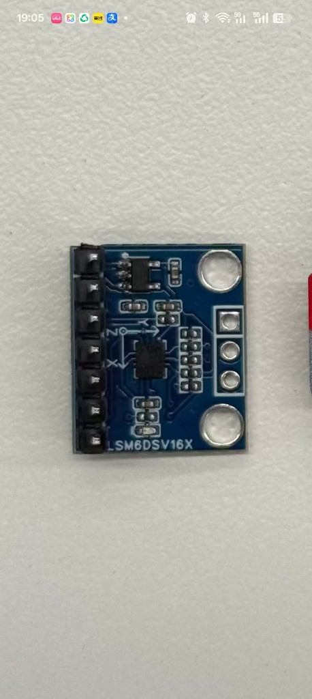

# 机身 IMU 测试板（1 号 · 2 号）

> **REFERENCE — NOT OFFICIAL。** DIY 两块测试版；**当前优先 1 号大板 · 原理图/PCB `imu-to-dxl v0.3`**（小板暂缓）。  
> 总线契约：DXL ID **200** · addr **124** · PHY **1G125**（仓：`imu_to_dxl/`）。  
> **BOM：** [[imu-to-dxl-ref-bom]]。接线：[[board-interconnect]]。  
> **固件编译（给 agent）：** [[imu-to-dxl-firmware-build]]。  
> **固件状态（2026-09-15）：** commit `a49a628` · Issue [#10](https://github.com/ScrapMeta/microduck-diy/issues/10) · U2D2 COM7 单挂 ID200：Ping/Read 1000 + SyncRead 10 min 通过 · `ready-for-pm`。

## 0. 两板对照（定稿）

| | **1 号 · 大板（现行优先）** | **2 号 · 小板（暂缓）** |
|--|-----------------|-----------------|
| 板框 | **32 × 22 mm**（实测定稿） | **22 × 15 mm** |
| 功能 | **完整** | **简化** |
| DXL 座 | **2×** B3B-EH-A | **1×** B3B-EH-A |
| 固定 | **四角** φ2.2 · 孔心距边 **1.5** · 长边孔距 **29** · 宽边孔距 **19** | 两边中心 M2 · φ2.2 · 孔距 19 |
| 调试 | **BM07B 7P**（SWD+UART+NRST） | 同系 7P（以后） |
| 版本 | **`imu-to-dxl v0.3`** | （以后） |
| 状态 | **原理图定稿 · PCB 打样** | 暂缓 |

装机区：两髋上方、电池背板一带。整机只挂 **一块** ID 200（两板不同时上机）。

```
1 号 32×22                         2 号 22×15（暂缓）
○──────────○  孔距29               M2─────┬─────M2
│ J2 调试   │  宽边孔距19                 │
│  U2 U1    │
│ J1     J3 │  双 EH
○──────────○
```

## 1. 共同电气（两板）

| 项 | 内容 |
|----|------|
| IMU | **LSM6DSV16X** · SPI + SFLP |
| MCU | **STM32G031F8P6** |
| PHY | **SN74LVC1G125** |
| LDO | AP2210K-3.3 一类宽 Vin |
| 总线保护 | 座子侧 `DXL_BUS`：TVS + 可选 5.1 V 钳位；R 串联到芯片侧 `DXL_DATA` |
| 针脚 | EH **1=GND · 2=VBATT · 3=DATA** |

## 2. 1 号大板要点（32×22 · 现行）

- 双 3P：可作链上中继；测试时下游舵机宜少。  
- **机械（实测）：** 板框 **32×22**；四角 φ**2.2** NPTH；孔心距板边 **1.5 mm**；**长边孔距 29 mm** · **宽边孔距 19 mm**。  
- 调试：**J2 = BM07B-SRSS-TB**（针脚见 §3 表）。  
- **布局参考图：** [`imu-to-dxl-board1-32x22-placement.svg`](../assets/pcb/imu-to-dxl-board1-32x22-placement.svg)

### 1 号布局要点

坐标：X 沿 32 mm，Y 沿 22 mm，原点左下；顶视=元件面。

| 孔心 | 坐标 mm |
|------|---------|
| 左下 / 右下 / 左上 / 右上 | **(1.5, 1.5)** · **(30.5, 1.5)** · **(1.5, 20.5)** · **(30.5, 20.5)** |
| 四孔中心（放 IMU） | **(16, 11)** |

| 区 | 放什么 |
|----|--------|
| 四角 | M2；周围约 **Ø4 mm** 禁布 |
| **(16, 11) 附近** | **U1 LSM6** + 轴丝印；旁 C1 |
| U1 左侧 | **U2** TSSOP；SPI 最短 |
| **底边**（Y≈0，朝外） | **J1**（左，进）· **J3**（右，出） |
| J1 或 **J3 旁** | **U3** + C4/C5/C2（C5 贴 VIN；电源可放 J3 侧） |
| J1 侧 DATA | **U6 + R6 + D1/D2**（保护贴进线座） |
| **顶边**（Y≈22，朝外） | **J2** BM07 7P（丝印见 [[imu-to-dxl-ref-bom]]） |
| 就近 | R2→U1 CS；R1/R3–R5→MCU；C3/C6；**Y1/C7/C8 不贴** |

```
Y=22  ○──── J2 BM07 7P ────○     孔距 29（X）
      │  U2     ★U1 LSM6    │
      │  LDO   U6 R6 D1/D2  │     孔距 19（Y）
Y=0   ○── J1 EH ── J3 EH ──○
      0         X=16        32
```

## 3. 2 号小板要点

- **只留 1× 3P** → 电气链尾（见 [[board-interconnect]] 线 B）。  
- 两边中心孔：勿学市售破板「两孔同端」悬臂。  
- 调试：**一只 BM07B-SRSS-TB（7P SH 1.0）** 合并原 J2 SWD + J4 UART + **NRST**（与自做 Pupper v3 STM32 烧录口同系）。建议针脚：

| Pin | 网名 |
|-----|------|
| 1 | +3V3 |
| 2 | SWCLK |
| 3 | SWDIO |
| 4 | GND |
| 5 | UART1_TX |
| 6 | UART1_RX |
| 7 | NRST |

（相对旧 BM04：1–4 同原 J2；5–6 同原 J4 的 TX/RX；7=NRST。若与你 Pupper 线序不同，以实物线束为准改表。）  
- 删旧 J2/J4/TP1；R1 10k NRST 上拉保留。  
- **机械：** 板框 **22×15**；两短边（宽边）中心各 φ**2.2** NPTH；**孔距 19 mm**（两端孔心距边各约 1.5 mm）；y 向居中。  
- **布局参考图：** [`imu-to-dxl-board2-22x15-placement.svg`](../assets/pcb/imu-to-dxl-board2-22x15-placement.svg)

### 2 号布局要点（22×15）

坐标约定：X 沿 22 mm，Y 沿 15 mm，原点左下；顶视=元件面。

| 区 | 位置 | 放什么 |
|----|------|--------|
| 孔 | (1.5, 7.5) · (20.5, 7.5) | M2 φ2.2；周围 Ø≥4 mm 禁布元件 |
| **跨中** | ≈(11, 7.5) | **U1 LSM6** + 轴丝印；旁贴 C1 |
| 左中 | U1 左侧 | **U2** TSSOP；SPI 走线尽量短 |
| 底边中 | 朝板外 | **J1** B3B-EH（1=GND 2=VBATT 3=DATA） |
| J1 左侧近电源 | | **U3** + C2/C4/C5（VBATT→3V3） |
| J1 右侧近 DATA | | **U6** + **R6** + **D1/D2**（紧贴 pin3） |
| 顶边中 | 朝板外 | **J2** BM07 7P 调试 |
| 散布 | U2/U3 旁 | R1–R5、C3/C6；**Y1/C7/C8 不贴** |

```
Y=15  ┌──────── J2 BM07 7P ────────┐
      │ M2 ○                    ○ M2 │  ← 孔距 19
      │      U2      U1 LSM6         │
      │      LDO    PHY/TVS/R6       │
Y=0   └──────── J1  EH 3P ─────────┘
      0            X=11            22
```

**注意：** B3B-EH 立高约 8 mm，确认电池背板间隙；22×15 极紧，优先保 SPI 短、DXL 保护贴座、IMU 居中。



## 4. 子文档

| 主题 | 页 |
|------|-----|
| 原理图 / **v0.3 BOM** / 摆放 / **仓内脚位** | [[imu-to-dxl-ref-schematic]] · [[imu-to-dxl-ref-bom]] · [[imu-to-dxl-ref-pcb-layout]] · 仓 `imu_to_dxl/docs/hardware.md` |
| 立创实单 | [[imu-to-dxl-lcsc-order-2026-09-09]] · [[imu-to-dxl-lcsc-order-2026-09-05]] |
| 接线 | [[board-interconnect]] |

相关：[[elec-three-boards]] · [[dual-imu-board-selection]] · [[imu-to-dxl-v2]] · [[diy-bom]]
